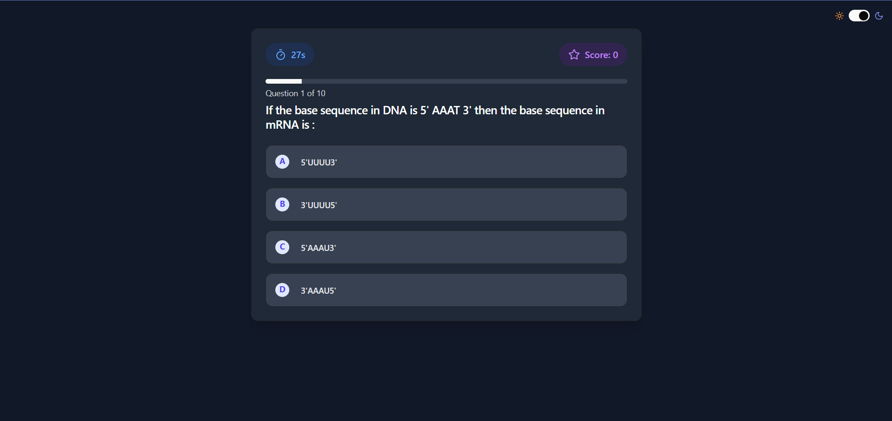
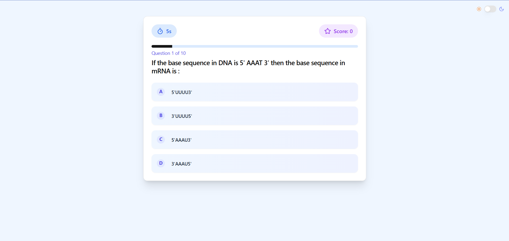

# Interactive Quiz Application

A modern, responsive quiz application built with React and Node.js that features real-time scoring, streaks system, and dark mode support.

## 🌙 Dark Mode Preview


## ☀️ Light Mode Preview


## 🎥 Demo

[Demo Video](https://drive.google.com/file/d/1-WqyBr1yjpYNW9xVku7EimB5tbng-oH9/view?usp=drive_link)

## ✨ Features

- 🎯 Real-time quiz taking experience
- ⏱️ Timer for each question
- 🌙 Dark/Light mode toggle
- 🔄 Streak system with bonus points
- 📱 Fully responsive design
- ⭐ Score tracking
- 🎨 Modern UI with smooth animations
- 🏆 End-of-quiz results summary

## 🛠️ Tech Stack

- **Frontend:**
  - React
  - Tailwind CSS
  - shadcn/ui components
  - Lucide React Icons

- **Backend:**
  - Node.js
  - Express.js

## 📋 Prerequisites

Before you begin, ensure you have the following installed:
- Node.js (v14 or higher)
- npm or yarn

## 🚀 Quick Start

1. **Clone the repository**
```bash
git clone https://github.com/Sauhardya27/Quiz-app-2.git
cd Quiz-app-2
```

2. **Setup the Backend**
```bash
# Navigate to server directory
cd server

# Install dependencies
npm install

# Start the server
npm run dev
```

3. **Setup the Frontend**
```bash
# Navigate to client directory
cd client

# Install dependencies
npm install

# Start the development server
npm run dev
```

4. **Environment Variables**

Create `.env` files in server directory:

Backend (server/.env):
```plaintext
PORT=5001
NODE_ENV = development
```

## 📁 Project Structure

```
Quiz-app-2/
├── client/                 # Frontend React application
│   ├── public/
│   ├── src/
│   │   ├── components/    
│   │   ├── lib/
│   │   ├── App.jsx
│   │   ├── index.css
│   │   ├── main.jsx     
│   │   └── QuizApp.jsx       
│   ├── components.json
│   ├── eslint.config.js
│   ├── index.html
│   ├── jsconfig.json
│   ├── postcss.config.js
│   ├── tailwind.config.js
│   ├── vite.config.js
│   ├── package-lock.json
│   └── package.json
│
├──  server/                # Backend Node.js application
│   ├── api/server.js        
│   ├── package-lock.json
│   └── package.json
└── package.json
```

## 🎮 Usage

1. **Starting a Quiz**
   - Navigate to the homepage
   - The quiz will start automatically
   - Answer questions within the time limit

2. **Scoring System**
   - Base points: 10 points per correct answer
   - Time bonus: Up to 6 bonus points based on remaining time
   - Streak bonus: Additional points for consecutive correct answers

3. **Features in Action**
   - Use the theme toggle in the top right to switch between dark and light modes
   - Watch your streak counter for bonus points
   - Monitor your score and remaining time for each question

Project Link: [Quiz-app](https://github.com/Sauhardya27/Quiz-app-2)


Made with ❤️ by Sauhardya